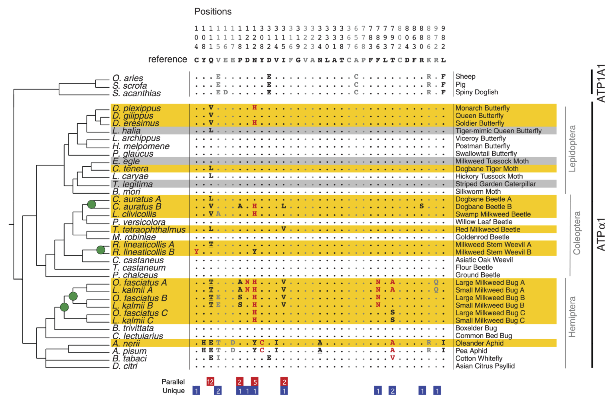
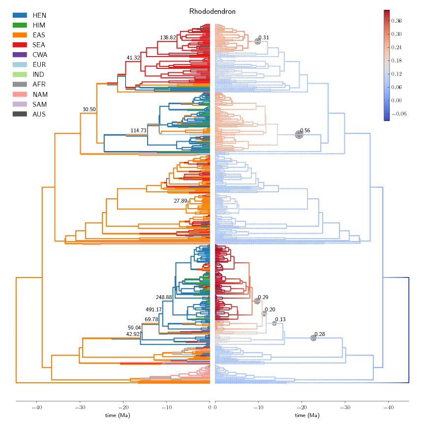
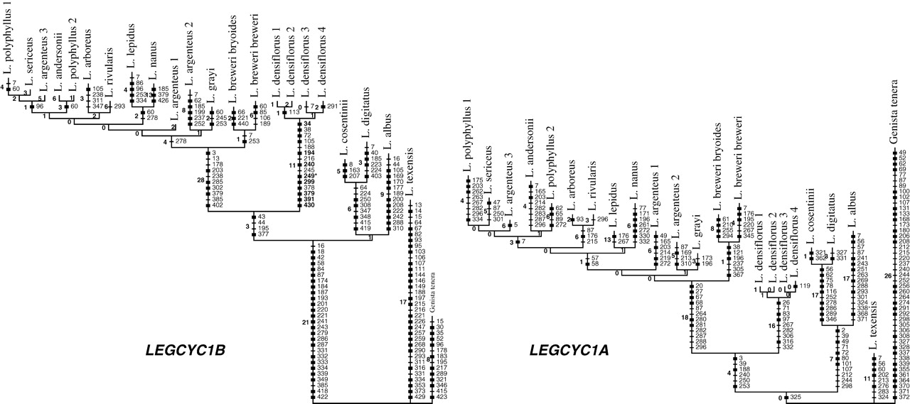

# Use-cases of visualization 

## Adaptive radiation illustration from educational web site

This example is from University of California Museum of Paleontology's [Understanding Evolution](http://evolution.berkeley.edu). It illustrates 
* time scale with tick marks and values
   * units
   * zero point registered to tips
   * labels on the time scale (mesozoic, cenozoic)
* images at the tips
* a vertical bar representing a time interval 
   * a label on the bar
* extinct branches that terminate prior to the present
* variable thickness of branches (not explained) 

## Illustrating parallelisms in insect cardenolide resistance

This is a fully loaded example. The highlighted insect species consume plants such as milkweed that produce compounds toxic or noxious to most animals.  The yellow species actually sequester cardenolides, which makes them noxious to predators.  Cardenolides bind to  ATP-alpha-1, and these insects tend to have changes in ATP-alpha-1 that confer resistance by disrupting binding.  The columns in bold are ones that have been implicated in site-directed mutagenesis in cardenolide-binding. 

* phylogeny at left is a straightforward rectangular tree 
   * it has meaningful branch lengths but no scale
   * there are green dots to indicate specific nodes
* character matrix is in the center
   * some rows are highlighted
   * columns are distinguished by grey vs. black font
   * individual char-states may have red letters to indicate parallel changes
* above the character matrix are character descriptors 
   * position, in vertically aligned text
   * reference character-state
* below the character matrix is another block of character descriptors
   * changes parallel among cardenolide-consuming insects
   * changes that are unique
* to the right of the char matrix is a column of common names (nice touch)
* at the extreme right are two sets of brackets
   * taxon brackets showing insect orders (species-tree concept)
   * ortholog brackets distinguishing ATP1A1 from ATPalpha1 (gene-tree concept)

## Branch coloring to show dynamic properties

This can be used to illustrate BAMM analysis, rates of speciation, continuous traits, etc.

## Geologic time scale alongside tree

This shows tree nodes alongside a standard table of geologic time scale (GTS). We might offer a few GTS alternatives, if there's no clear consensus.

## Stacked colored lines (left figure) indicating aggregated states changing along branches

## Simple cases

At a minimum, we need to support the simplest cases that are in papers: i.e., colored labels, branch widths, clade designations.

It is also possible that one might want to indicate a group of terminal taxa that don't completely correspond to clade, e.g. geography.

### Branch labels, markers, and labeled markers

### Vertical labels, branch length calibration rulers, node images and silhouttes

http://www.nature.com/nature/journal/v526/n7574/fig_tab/nature15697_F1.html

### Silhouettes, node background, more branch length rulers, notes on nodes

http://www.nature.com/articles/srep20252/figures/2

### backgrounds, vertical label bands

http://www.sciencedirect.com/science/article/pii/S1055790313000298#f0005

### collapsed nodes, aligned data matrices 
http://www.nature.com/nature/journal/v504/n7479/fig_tab/nature12779_F2.html

### large trees summarized (e.g. metagenomics), circular tree representation, Bars in terminal nodes

http://www.nytimes.com/interactive/2012/06/19/science/0619-microbiome.html?ref=science&_r=0 

## Notes Oct 18

(Please edit freely -- this is not my forte!)

* BAMM colormap tree tricky - in terms of storage - values are assigned to branch segments
* recruit R expert?
* artifact of squishing short branches + outline of path
* need reference marks, not every kind of visual shape, geological timescale, etc
* don't need to replicate fancy R addons with built-in design decisions
* main thing is to represent data -- use skeleton indicators that can be enhanced e.g. in Illustrator
* out of scope to support arbitrary positioning to manage crowding
* levels of abstraction - data values and style/presentation
* need to accomodate accessibility -- choosing alternative styles
* need to define what graphical features to serialize
* want to serialize data ("bootstrap value"), but this is difficult for tree viewers to handle
* separate data values and graphical renderings
* use nexson for data serialization?
* Stamatakis paper - problem of rooting in tree viewers - e.g. can lead to incorrect placement of bootstrap values
* serialization - nested vs non-nested representation of trees?
* newick is inadequate

## scrap and notes

* I like this: http://epidemic.bio.ed.ac.uk/how_to_read_a_phylogeny
* p. 2 of this http://www.calvin.edu/~rpruim/talks/SC11/2011-06/SC11-Calvin-Rendon/bioinformatics.Day2/D2.1.Reading%20Phylogenetic%20Trees.pdf .  find source on berkeley site.  use this.  
* There's a [collection of "wish-list" images](https://github.com/OpenTreeOfLife/tree-illustrator/tree/master/wishlist-images) in the Tree Illustrator repo (some shown above).
